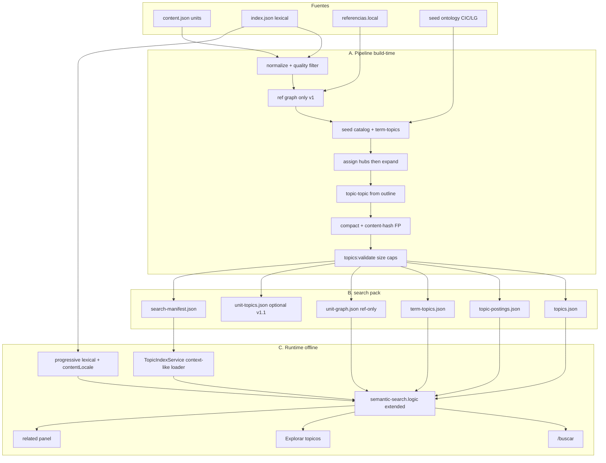
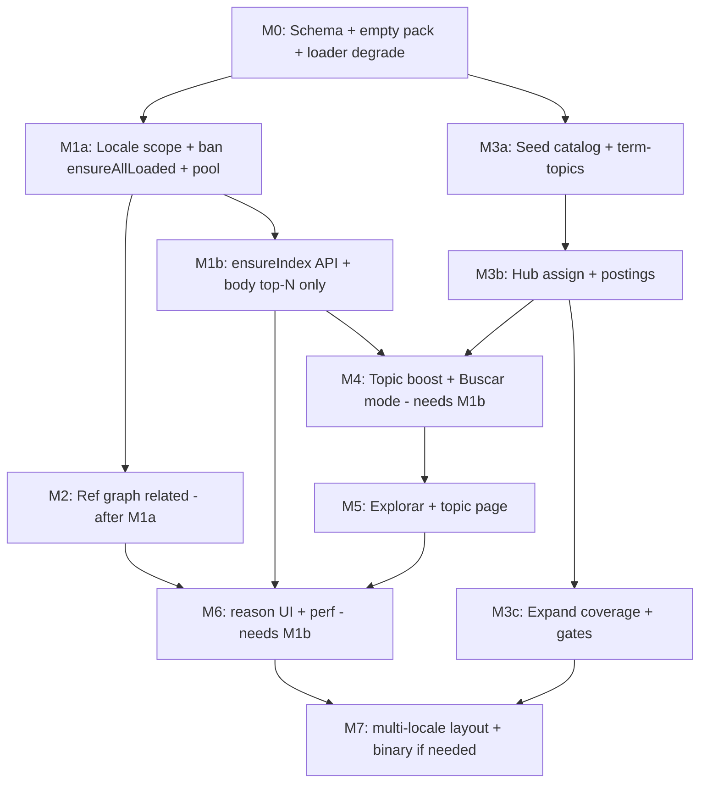

# Diseño: búsqueda profunda indexada por tópicos (Documentos Vaticanos)

| Campo | Valor |
|-------|--------|
| **Título** | Deep intelligent topic-indexed search |
| **Autor** | (agente / arquitectura) |
| **Fecha** | 2026-07-26 |
| **Estado** | Draft (rev. 2.1 — residual review: ensureIndex, PR deps, validate FP) |
| **Ámbito** | Offline-first PWA + Capacitor; análisis pesado solo en build/CI |
| **Relacionados** | `docs/CORPUS-STRUCTURE-ANALYSIS.md` (snapshot histórico ~184 MiB/125 docs — **no** usar solo ese doc para tamaños actuales), `docs/FASE-2-PLAN.md` §3.3, `AGENTS.md` §1–2, `frontend/src/app/core/search/semantic-search.logic.ts`, `frontend/src/app/core/context/historical-context.service.ts` |

---

## Overview

La app ya ofrece búsqueda léxica offline sobre índices invertidos por documento (`index.json`) y un ranking de “intención” con stopwords, IDF ligero y un léxico acotado (`RELATED_TERMS`, **16 claves** en `semantic-search.logic.ts`). Los “pasajes relacionados” del panel `app-related-units-panel` son **solo léxicos**. El usuario pide un sistema **profundo, indexado, rápido y ligero** que cubra:

1. consultas generales (texto libre / intención),
2. consultas temáticas (tópicos teológicos),
3. consultas contextuales (vecindario de una cita o concepto).

La propuesta separa **análisis pesado en build-time** (ontología + etiquetado multi-label + grafo de citas **ref-only en v1** + opcional embeddings que **no se embarcan**) de **artefactos compactos en runtime** con **techos de tamaño normativos en CI**. El runtime usa funciones puras offline; **no hay chatbot ni inferencia de LLM en dispositivo** en v2.0.

**Requisitos de primer orden (rev. 2 / 2.1):**

1. **Búsqueda progresiva locale-scoped** — `/buscar` y related **no** deben llamar `ensureAllLoaded()` sobre 741 docs.
2. **Body-lazy real** — ranking usa **`CorpusService.ensureIndex(documentId)`** (solo `index.json`); `ensureLoaded` (body+index) **solo** para top-N snippets, seed de related y docs de vecinos del grafo. **No** es aceptable “cargar body de los ~135 ES” como diseño v1.
3. **Universo de query por defecto** = `meta.locale === resolvedContentLocale` (`reader.prefs.v1.contentLocale`).
4. **Caps duros** de pack `search/es/` validados en `topics:validate` + CI.
5. **Fingerprint con content-hash** — `topics:validate` **recalcula** hashes live del corpus ES y **falla** si el pack está stale.
6. **Related / grafo** no se mergea a UI hasta load path progressive (PR2a mínimo; PR2b bloquea lexical full y topic UI pesada).

---

## Background & Motivation

### Estado actual (medido en workspace, 2026-07-26)

Medición: `python` sobre `documentos/corpus/manifest.json` + `stat` de `documents/**/{content,index}.json`.  
**Nota:** `docs/CORPUS-STRUCTURE-ANALYSIS.md` describe un snapshot anterior (~184 MiB / ~125 docs). Los números canónicos para este diseño son los de la tabla siguiente.

| Métrica | `documentos/corpus` (= `frontend/src/assets/corpus`) |
|---------|------------------------------------------------------|
| Documentos en `manifest.json` | **741** |
| Suma `unitCount` | **782 772** |
| `content.json` total | **~825 MB** |
| `index.json` total | **~462 MB** |
| Total content+index | **~1.29 GB** |
| Locales | es 135, en 171, ar/hi/zh 135 c/u, la 25, … |
| Solo ES | **135 docs**, **155 015 units**, ~118 MB content + ~76 MB index ≈ **194 MB** |

**Kinds ES (por units):** patristic ~103k, bible ~36k, catechism ~6.3k, magisterium ~6k, canon-law ~3.3k, council ~0.4k.

**Referencias ES:** ~3.7k units con `referencias` no vacías; **~2 489** con al menos un `local: { idDocumento, idPunto }` (~1.6 % de units). Densidad baja, **alta calidad semántica**.

**`idPunto`:** el modelo `Referencia.local` admite índice o consecutivo en comentarios de tipos; el pipeline `scripts-descarga/resolve_refs.ts` escribe **`idPunto: String(idx)` donde `idx` es el array index** del target (`String(idx)` en resolución bíblica y eclesial). El builder de grafo debe tratar el output resuelto como **unitIndex**; si aparece un valor no numérico o fuera de rango, **descartar** la arista (no inventar índices).

### Qué ya existe y se reutiliza

| Pieza | Ruta | Rol |
|-------|------|-----|
| Índice invertido | `documents/<id>/index.json` → `{ indice, indice_por_punto }` | term → `unitIndex[]` |
| Reindex / build índice | `reindex_offline.ts`, `src/pipeline/build_index.ts` | generación léxica |
| Dual-write corpus | `src/pipeline/write_corpus.ts` (`CORPUS_ROOTS`) | ambos roots |
| Sibling pack precedente | `assets/corpus/context/` + `HistoricalContextService` | HTTP + memoria, degrade empty, **sin IDB** |
| Modelos pack | `corpus.model.ts` / `corpus.models.ts` | `DocumentMeta`, `Article`, `Referencia` |
| Ranking / related | `semantic-search.logic.ts` | `parseSearchInput`, `rankUnits*`, `searchCorpus`, `findRelatedUnits`, `suggestRelatedCitations`, quality gates |
| UI buscar | `/buscar` + `app-buscador` + `BuscadorService` | 3E, debounce **400 ms**, hoy `ensureAllLoaded` |
| Related panel | `app-related-units-panel` | tema / documento / santo |
| Durable reading store | `dv-corpus-v1` | fingerprint lectura = `id\|bodyPath\|indexPath\|unitCount` (**no** content-hash) |
| Compresión ship | `scripts/corpus-compress.js` | higiene de `content.json` only |
| ngsw | `frontend/ngsw-config.json` | `assets/**` → `installMode: lazy` |
| Explorar chips | `explorar.component.ts` `topicChips` | hardcoded |
| Prefs | `reader.prefs.v1` | `contentLocale`, `uiLocale`, … |

### Dolor actual

1. **Sin capa temática real** — sin catálogo ni postings multi-documento por tema.
2. **Related = léxico** — sin grafo de citas ni tópicos.
3. **`RELATED_TERMS` = 16 claves** manuales; no escala.
4. **`ensureAllLoaded()`** hace `forkJoin` de **todos** los ids del manifest (741 / ~1.3 GB). Además, `CorpusLoadEngine.loadDocument` (hoy) **siempre** pide **body + index** juntos — no existe `ensureIndex`. Afecta **general search y related**.
5. **Sin filtro `contentLocale`** en `/buscar` — ranking cruza 5 near-duplicates AI.
6. **OCR ruidoso** en patrísticos contamina términos.
7. **Explorar → Temas** placeholder; no confundir con **Mis temas** (`themes.user` / API `Theme`).

### Qué NO es esta feature

- Chatbot / RAG en runtime.
- Reordenar units en `content.json`.
- Sustituir el índice léxico (lo **complementa**).
- CDN firmado de packs en v1 (mismo origen only).

---

## Goals & Non-Goals

### Goals

1. Pipeline build-time → **topic pack** versionado con **caps CI**.
2. Runtime offline: general / temático / contextual; p95 topic lookup **&lt; 100–200 ms** en móvil medio.
3. Citas estables: `documentId` + `unitIndex`.
4. Ship ligero: techo v1 **`search/es/` ≤ 12 MB raw / ≤ 4 MB gzip** (assert CI).
5. UX: `/buscar`, Explorar tópicos corpus, related; deep links contractuales.
6. Fases incrementales (PR plan).
7. Layout multi-locale desde día 1; **v1 implementa ES**.
8. **Progressive lexical search** locale-scoped + **index-only API** (`ensureIndex`) como entrega temprana (PR2a/PR2b); bloquea topic UI pesada y related lexical amplio.
9. **Default query universe** = locale de contenido activo.
10. **`topics:validate` freshness** — fail-closed si fingerprint del pack ≠ corpus live.

### Non-Goals (v1–v2 producto)

- Inferencia LLM / embeddings en dispositivo o API de chat.
- Servidor como motor de query (CDN de artefactos estáticos = futuro, fuera de v1).
- MiniSearch/FlexSearch obligatorio.
- Unificar temas personales del usuario con tópicos de corpus.
- Cobertura OCR perfecta.
- Vectores densos de 780k units.
- Aristas masivas same-doc / co-cita densa / topic-overlap global en v1.
- Integridad criptográfica CDN (v1 = same-origin).

---

## Proposed Design

### Principio: “red neuronal” = grafo + precomputación, no runtime neural

```text
        ┌─────────────────────────────────────────────┐
        │  Build / CI (GPU/CPU opcional, LLM opcional) │
        │  corpus content + refs + seed ontology        │
        │       ↓  embeddings (descartados al final)   │
        │  topic-pack compact + topics:validate caps    │
        └───────────────────┬─────────────────────────┘
                            │ commit/ship assets (like context/)
                            ▼
        ┌─────────────────────────────────────────────┐
        │  Runtime (PWA / Capacitor)                    │
        │  progressive lexical (index-only + snippets)  │
        │  + topic postings + term→topic + ref graph    │
        │  pure TS; contentLocale default scope         │
        └─────────────────────────────────────────────┘
```

### Arquitectura en capas



---

### A. Pipeline de análisis offline (build-time)

**Ubicación:** `scripts-descarga/src/topics/` · CLI `npm run topics:build` / `topics:validate` / `topics:export-review`.

**Entrada v1:** docs con `locale === 'es'` desde `documentos/corpus/manifest.json` + `content.json` / `index.json`.

**Salida dual-write** (como `write_corpus.ts` / `context/`):

```text
documentos/corpus/search/
  search-manifest.json
  es/
    topics.json
    topic-postings.json
    term-topics.json
    unit-graph.json          # solo keys con ≥1 arista ref
    unit-topics.json         # opcional v1.1; ver B.0 minimal set
frontend/src/assets/corpus/search/   # espejo ship (committed v1)
```

#### A.0 Caps normativos (schema + `topics:validate` + CI)

Estos límites son **normativos**, no orientativos. Fallar el build si se exceden.

| Cap | Valor v1 ES | Notas |
|-----|-------------|--------|
| `MAX_TOPICS_PUBLISHED` | **≤ 250** seed publicados; discovered **0** en ship hasta review CSV | Q4 cerrado |
| `MAX_POSTINGS_PER_TOPIC` (M) | **≤ 200** | sort keys abajo |
| `MAX_UNIT_TOPIC_ROWS` | **≤ 40 000** si se emite `unit-topics` | hubs-first |
| `MAX_TOPICS_PER_UNIT` (K) | **≤ 4** | |
| `MAX_GRAPH_KEYS` | solo units con ≥1 arista `ref` (≈ ≤ 3 500 ES hoy) | no materializar units sin edges |
| `MAX_DEGREE` por nodo | **≤ 16** (top por peso) | |
| `MAX_EDGE_TYPES_V1` | **`ref` (+ reciprocal opcional)** | ver A.3 |
| **Total `search/es/` raw** | **≤ 12 MB** | assert `du` / walk |
| **Total `search/es/` gzip -9** | **≤ 4 MB** | CI |
| Heap parse estimado | **≤ 25 MB** | si raw JSON &gt; 8 MB considerar binary path (B.5) |

Si JSON supera techo: **path obligatorio** a packing binario (u16/u32 + varint postings) en el mismo PR de fix, no aplazado a “polish”.

#### A.1 Ontología semilla + descubrimiento diferido

**Semilla v1 (publicada):**

- Outline CIC (partes/secciones → tópicos canónicos).
- Temas de constituciones (`lg-es`, …) + aliases de chips Explorar actuales.
- Extensión de las **16** claves `RELATED_TERMS` → entradas `term-topics`.
- Archivo canónico: `scripts-descarga/config/topics-seed.es.json`.

**Descubierto:** solo en build/report + `topics:export-review` CSV. **No entra al pack ship** hasta curación humana y bump de seed.

**IDs:** `topic:<locale>:<slug>` (ej. `topic:es:gracia`).

#### A.2 Asignación unit → tópicos (multi-label + confianza)

```ts
/** Build intermediate; ship encoding in UnitTopicsFile if emitted */
export interface UnitTopicAssignment {
  documentId: string;
  unitIndex: number;
  topics: Array<{
    topicId: string;
    conf: number; // 0..1; ship as u8 quantize later
    source: 'seed' | 'lexical' | 'llm' | 'ref-propagate';
  }>;
}
```

**Estrategia v1:**

1. Lexical seed match en anclas del tópico.
2. Ref-propagate: unit que cita (arista `ref`) a unit hub etiquetado hereda conf atenuada.
3. LLM build opcional (`--with-llm`) solo hubs CIC / Vat. II cortos.
4. **Postings v1 priorizan kinds:** `catechism` | `magisterium` | `council` | `canon-law`.  
   **Bible / patristic:** no full multi-label; solo aparición en postings vía **ref-propagate hacia hubs** o match seed de muy alta conf, con cap global de filas.

**Embeddings:** solo build; se descartan.

#### A.3 Grafo de citas — **v1 = solo `ref`**

**Nodos:** `(documentId, unitIndex)`.

| Tipo | v1 | Origen | Peso |
|------|----|--------|------|
| `ref` | **sí** | `referencias[].local` resuelto a unitIndex | 1.0 |
| `ref-reciprocal` | opcional | arista inversa si B no tenía A | 0.85 |
| `coref` / co-cita simétrica densa | **no** | diferido | — |
| `sequential` same-doc ±1 | **no** (nunca global) | diferido; si se añade después: solo hub docs, degree-capped, flag off by default | — |
| `topic-overlap` materializado | **no en v1** | runtime puede calcular overlap **solo entre candidatos** (hits léxicos ∪ vecinos ref), sin archivo masivo | — |
| `lexical` materializado | **no** | — | — |

**Resolución `idPunto`:** preferir parseInt como unitIndex (output de `resolve_refs.ts`). Validar `0 ≤ idx < unitCount`. Descartar unresolved.

**Quién tiene clave en `unit-graph`:** **solo** units con ≥1 arista saliente o entrante tras caps. No emitir entradas vacías ni cadena lineal de 36k versículos.

Salida tipada: ver § API (`UnitGraphFile`).

#### A.4 Tópico ↔ tópico

Solo desde outline seed (`parentId` / `relatedIds` en `topics.json`). Sin co-ocurrencia masiva en v1.

#### A.5 Mapa término → tópicos

```ts
// term-topics.json — keys folded like index (foldToken)
{
  "gracia": [{ "topicId": "topic:es:gracia", "w": 1.0 }],
  "caridad": [{ "topicId": "topic:es:caridad", "w": 0.9 }, { "topicId": "topic:es:amor", "w": 0.5 }]
}
```

#### A.6 Versionado e invalidación (content-hash)

```ts
// search-manifest.json (conceptual)
{
  "version": "1.0.0",
  "schema": 1,
  "locale": "es",
  "generatedAt": "ISO",
  "corpusFingerprint": {
    "algo": "sha256",
    // Canonical string per doc (sorted by documentId), then hash of concatenation:
    //   documentId | unitCount | bodyPath | indexPath | contentSha256 | indexSha256
    // contentSha256 = sha256(raw content.json bytes)
    // indexSha256   = sha256(raw index.json bytes)  // optional but recommended
    "value": "…",
    "docCount": 135
  },
  "caps": { "maxTopics": 250, "maxPostingsPerTopic": 200, "maxRawBytes": 12582912 },
  "topicCount": 180,
  "edgeCount": 4200,
  "files": {
    "topics": "es/topics.json",
    "postings": "es/topic-postings.json",
    "termTopics": "es/term-topics.json",
    "graph": "es/unit-graph.json"
    // "unitTopics": "es/unit-topics.json"  // if present
  }
}
```

**Importante — dos fingerprints distintos:**

| Contexto | Fingerprint | Detecta |
|----------|-------------|---------|
| Lectura (`documentFingerprint` en `corpus-load.logic.ts`) | `id\|bodyPath\|indexPath\|unitCount` | path / unitCount; **no** reescritura OCR del texto |
| Topic pack (`corpusFingerprint` arriba) | incluye **contentSha256** (± indexSha256) | OCR repair, punctuation repair, reindex terms, unit reorder |

Implementadores **no** deben asumir “mismo fingerprint de lectura ⇒ mismo texto para topics”. Rebuild de topics cuando cambie content/index hash aunque `unitCount` sea estable.

#### A.6.1 `topics:validate` — frescura del fingerprint (normativo)

`topics:validate --locale es` **debe**, en este orden:

1. Schema + caps A.0 + golden (si aplica).
2. **Recomputar** el fingerprint canónico leyendo los bytes actuales de `documentos/corpus` (o root dual) para todos los docs `locale===es` listados en el manifest de lectura.
3. Comparar con `search-manifest.json` → `corpusFingerprint.value`.
4. Si difieren → **exit non-zero** (fail-closed). Mensaje: “search pack stale; run topics:build”.
5. Flag **`--skip-fp`** solo para fixtures unitarias locales / tests de schema — **prohibido** en CI de producto (`.ci-build.sh`, `yarn test:*` de corpus topics).

PR8 (rebuild incremental) **optimiza** el build; **no** sustituye este gate de corrección. Un pack committed con postings viejos **no** puede pasar CI en verde.

**Regla de oro:** el pipeline **nunca reordena** `content.json`.

#### A.7 Quality gates (build)

| Gate | Acción |
|------|--------|
| OCR term noise | no seed/discovered desde tokens que fallen filtros repair |
| Stopwords | lista ES |
| Over-broad | max % units del subcorpus hub |
| Under-specified | min units + min distinct docs |
| Ref spam | degree cap; no self-loops; drop unresolved |
| Size caps | A.0 — fail CI |
| Human review | CSV discovered only |

#### A.8 Golden queries (operabilidad)

Fixture `scripts-descarga/fixtures/topics-golden-queries.es.json` + test en `topics:validate` / pure tests:

| Query | Expectativa mínima (v1 hubs) |
|-------|------------------------------|
| `gracia` | top postings incluyen `cic-es` (y/o magisterio) |
| `trinidad` | catecismo / magisterio en top-M |
| `matrimonio` | CIC moral / familiaris o equivalente seed |
| `eucaristía` / `eucaristia` | sacramentos CIC |

Fallar soft en CI report si coverage de golden &lt; umbral (warn → error tras PR3b estable).

---

### B. Artefactos runtime (compactos)

#### B.0 Conjunto mínimo v1 vs completo

| Artefacto | v1 ship | Rol |
|-----------|---------|-----|
| `search-manifest.json` | **sí** | version + content-hash FP + caps |
| `topics.json` | **sí** | catálogo seed |
| `term-topics.json` | **sí** | expansión query / resolve topic |
| `topic-postings.json` | **sí** | browse temático + **boost C.1 vía membership** |
| `unit-graph.json` | **sí** (ref-only, sparse keys) | related contextual |
| `unit-topics.json` | **no obligatorio v1** | solo si se necesita panel “tópicos de este pasaje” o boost sin escanear postings; si se omite, boost = `hit ∈ postings[queryTopics]` |

**Justificación thinner cut:** general boost no requiere mapa unit→topics si los postings de los tópicos resueltos de la query son sets consultables (invertir en memoria al load: `Set` de `"documentId:unitIndex"` por topicId, o un `Map` global de membership). Ahorro estimado 2–8 MB raw.

#### B.1 Presupuesto (alineado a caps A.0)

| Artefacto | Estimación v1 ES con caps |
|-----------|---------------------------|
| `topics.json` ≤ 250 | ≤ 150 KB |
| `term-topics.json` | ≤ 400 KB |
| `topic-postings` ≤ 250×200 | **≤ 3–6 MB** JSON |
| `unit-graph` ref-only ~2.5k–4k keys × deg≤16 | **≤ 1 MB** |
| `unit-topics` (si se emite, ≤40k rows) | ≤ 3 MB |
| **Total** | **≤ 12 MB raw / ≤ 4 MB gzip** (CI) |

Delta APK/web vs corpus ~1.3 GB: **marginal (&lt;1 %)**. Embarcar `search/es` en v1 es barato.

#### B.2 Packaging & CI

| Tema | Decisión v1 |
|------|-------------|
| **Git** | **Commit** `search/es/` en ambos roots (precedente `corpus/context/`, ~1.6 MB context ya tracked). Generar con `topics:build` en dev/CI; no dejar artefacto solo local. |
| **CI** | `.ci-build.sh` / test scripts: `topics:validate` **fail-on-cap** + **fail-on-stale-fingerprint** (ver A.6.1) + golden warn/error. Flujo: o bien CI ejecuta `topics:build` y commitea/artefacta `search/`, o el PR que toca corpus ES **debe** incluir rebuild de `search/` — validate **no** es solo schema. |
| **`corpus-compress.js`** | Hoy solo higiene `content.json` / drop meta. **No debe borrar ni reescribir** `search/**`. Añadir test de contrato: walker ignora `search/` o pasa through. |
| **`package-*.sh` / Capacitor** | Incluye `assets/corpus/**` → `search/` viaja en APK/web automáticamente. |
| **ngsw** | `assets/**` lazy: primera sesión PWA puede **no** tener fetch de `search/` hasta abrir Explorar/Buscar temático. **Debe degradar** (léxico + related sin grafo). Capacitor: archivos en disco del APK sin depender de ngsw. |
| **Empty PR1** | Manifest mínimo + topics vacíos o seed-only sin postings: válido; UI degrade. |

#### B.3 Carga runtime — patrón `HistoricalContextService` (preferido v1)

**Precedente:** `HistoricalContextService` carga `assets/corpus/context` vía `HttpClient`, caché **in-memory**, `catchError` → manifest vacío, sin IDB.

**`TopicIndexService` v1 (recomendado):**

- Mismo patrón: HTTP/asset fetch + `shareReplay` + empty on error.
- Caché en memoria del pack del **locale activo**.
- **Sin `dv-search-v1` en v1** salvo que el pack crezca &gt; ~8 MB raw o se mida thrash de parse en low-end; entonces IDB opcional v1.5 con eviction por `corpusFingerprint.value` mismatch.

Si se introduce IDB más tarde:

| DB | Stores | Eviction |
|----|--------|----------|
| `dv-search-v1` | `manifest`, `files` by key | borrar todo si `version` o `corpusFingerprint.value` ≠ pack en assets |

Separado de `dv-corpus-v1` (lectura).

#### B.4 Estructuras de consulta

Índice léxico propio (sin MiniSearch obligatorio). Al load de postings, construir:

```ts
// in-memory after parse
postingMembership: Map<string /* topicId */, Set<string /* docId:unitIndex */>>
// or inverted:
unitBoostTopics: Map<string, Array<{ topicId: string; conf: number }>> // only if unit-topics shipped
```

#### B.5 Binary packing path (normativo si se excede techo)

Si `topics:validate` falla por raw/gzip:

1. `topic-postings.bin` + small JSON header (topicId → offset).
2. `unit-graph.bin` adjacency lists packed.
3. Mantener `topics.json` + `term-topics.json` legibles.
4. Mismo schema `files` en manifest apunta a `.bin`.

No esperar a “PR polish” sin techo.

---

### C. Modos de consulta runtime (funciones puras)

Módulos: `topic-search.logic.ts` + extensión de `semantic-search.logic.ts` — **sin Angular**.

#### C.0 Scope de corpus (obligatorio en todos los modos)

```ts
function docsInContentLocale(
  metas: DocumentMeta[],
  contentLocale: string, // resolved from reader.prefs.v1; not 'system' raw
  opts?: { allLocales?: boolean },
): DocumentMeta[] {
  if (opts?.allLocales) return metas;
  return metas.filter((m) => (m.locale || 'es') === contentLocale);
}
```

- **Default:** solo locale activo.
- **Override UX:** “Todos los idiomas” (opt-in explícito) → `allLocales: true`.
- **Related / graph:** aristas **nunca cruzan locale** en v1 (si `documentId` target es otro locale, drop en build o en runtime).
- **Twins:** `cic-es` y `cic-en` **no** comparten `unitIndex` como si fueran el mismo pack (AGENTS.md §2.5).

#### C.1 General (léxico progresivo + boost temático)

**Hecho de código (hoy):** `CorpusLoadEngine.loadDocument` siempre hace fetch de `bodyPath` **y** `indexPath`. `rankUnitsForDocument` es **index-first**; el body solo aporta phrase bonus / `consecutivo` / snippets. Por tanto el diseño **exige** una API nueva — no basta con filtrar locale y seguir llamando `ensureLoaded` a los ~135 ES (~**194 MB** content+index), que aún puede OOM en mid/low-end.

##### C.1.1 API objetivo: `ensureIndex` (normativa para progressive v1)

```ts
// corpus.service.ts / corpus-load.logic.ts — NEW
/** Load/cached inverted index only. Does not require content.json in memory. */
ensureIndex(documentId: string): Observable<{ meta: DocumentMeta; indice: Indice }>;

/**
 * Full body+index (existing). Use for reader, snippets, seed unit text.
 * If index already in memory from ensureIndex, reuse it; fetch body only when possible.
 */
ensureLoaded(documentId: string): Observable<LoadedDocument>;
```

Implementación de referencia:

- Fetch solo `resolveAssetPath(meta.indexPath)`.
- Caché en memoria: `Map<documentId, Indice>` (y opcional entrada parcial en IDB **sin** body, o no persistir index-only en v1 para no complicar fingerprint de `dv-corpus-v1`).
- `ensureLoaded` posterior: si hay index cacheado, fetch **solo** `content.json` y ensambla `LoadedDocument`.
- Fingerprint de lectura del store durable **sin cambios** cuando se guarda full doc; index-only cache es memoria (o store key distinta si se añade después).

##### C.1.2 Pipeline de query (normativo tras PR2b)

```text
1. loadManifest()
2. metas = docsInContentLocale(metas, contentLocale)
3. ensureIndex(documentId) for each meta in scope
     — concurrency pool: MAX_CONCURRENT_INDEX_LOADS = 4..8 (default 6)
     — cancel in-flight pool when query string changes (new debounce tick)
     — optional UX: show partial ranked hits as indices arrive (“rank partial”)
4. rankUnitsForDocument({ documentId, index, units: [] })  // units empty OK
5. topic boost via posting membership (if pack ready)
6. take top N global (N = 50 page default)
7. ensureLoaded(documentId) ONLY for unique docs among top N hits (snippets)
     — acceptance: body fetches per query ≤ N_unique_docs (≤ N), never |metas|
```

##### C.1.3 Split de entrega (PR2a / PR2b)

| PR | Entrega | ¿Body-lazy real? |
|----|---------|------------------|
| **PR2a** | Locale scope; ban `ensureAllLoaded`; pool concurrent 4–8; related/buscar usan solo metas del locale | **No** del todo: puede llamar `ensureLoaded` por doc de locale **como deuda explícita y temporal**, con risk “~194 MB ES still possible” y test de que **no** hay 741-load |
| **PR2b** | `ensureIndex` + rank sin body + body solo top-N | **Sí** — diseño completo |

**PR2b bloquea:** PR5 (modo temático / boost UI que hidrata muchas filas), PR7 (related lexical amplio + perf claims), y cualquier claim de “index-only progressive” en release notes.

**Prohibido en cuanto mergea PR2a:** `ensureAllLoaded()` en `buscador.component` / `related-units-panel`.

Acceptance tests:

- Static/grep: no `ensureAllLoaded` en esos paths.
- Mock multi-locale: solo ids del `contentLocale` reciben load.
- **PR2b:** instrumentación o mock de HTTP — bodyPath requested count ≤ unique top-N docs; indexPath puede ser |metas|.

`α` = 0.15–0.35. Facets: `kind`, `documentId`, `minConf`.

**Phrase bonus sin body:** omitir o aplicar solo sobre hits ya hidratados en top-N (segunda pasada barata). No cargar 135 bodies solo para phrase bonus.

#### C.2 Temático

```text
resolveTopics(q | slug) → TopicRecord
citationsForTopic(topicId) → TopicCitation[]  // already ranked in build
filter facets / contentLocale (postings already ES in v1)
hydrate snippets via ensureLoaded(documentId) for unique docs in page
```

**Sort keys dentro de postings (build-time), en orden:**

1. `conf` desc  
2. kind prior: catechism &gt; magisterium &gt; council &gt; canon-law &gt; bible &gt; patristic  
3. `documentId` asc, `unitIndex` asc (estable)

#### C.3 Contextual / vecindario

**Algoritmo related v1 (acotado — no full-locale lexical):**

```text
1. seed = (documentId, unitIndex)
2. ensureLoaded(seed.documentId)           // need unit body for seed text + chrome
3. graphNeighbors = unitGraph.neighbors(seed)  // reason: 'ref'; same locale only
4. neighborDocIds = unique documentIds from graphNeighbors (cap degree already ≤16)
5. ensureLoaded each neighborDocId (pool 4–8)  // bodies for snippets of graph hits
6. refRows = map graphNeighbors → RelatedCitationRow (reason: 'ref')
   // bypass lexical filterRelatedHits seed-kernel; still diversify maxPerDocument

7. lexicalCandidateDocs = BOUNDED set, not all locale metas:
     a. docs already in memory/cache from steps 2–5
     b. plus hub kinds in contentLocale: catechism|magisterium|council|canon-law
        (from manifest filter) — cap HUB_DOC_CAP = 40
     c. optional preferDocumentIds from panel inputs
   // NEVER forkJoin all 135 ES for related in v1

8. For lexical candidates:
     - if PR2b done: ensureIndex + rank; ensureLoaded only for lexical top-L (L≤12)
     - if only PR2a: ensureLoaded on candidate set only (≤ ~40 hubs + cached), not full locale

9. findRelatedUnits / suggestRelatedCitations on that candidate SearchDocumentInput[]
10. optional topic-overlap runtime ONLY among:
      graphNeighbors ∪ lexical top pool (cap 48 units) — not full corpus
11. merge re-rank: ref (1.0) > topic-overlap (0.6) > lexical (0.4)
12. limit 8; diversify
```

**Hasta PR2b:** related lexical se declara “hubs + cached only”; no se promete recall sobre toda la Biblia/patristic en related.

#### C.4 Objetivos de rendimiento y concurrencia

| Operación | Target p95 | Notas |
|-----------|------------|--------|
| Topic lookup top 50 | **&lt; 100 ms** | postings en memoria |
| General search tras PR2b (ES indices ~76 MB worst, no 194 MB bodies) | **&lt; 500–800 ms** interactivo cold; warm &lt; 300 ms | pool 4–8 index loads |
| Related graph+bounded lexical | **&lt; 200–400 ms** post-seed | no 135 bodies |
| Topic pack heap | **≤ 25 MB** | caps A.0 |

**Controles de concurrencia (normativos en PR2a+):**

| Parámetro | Valor |
|-----------|--------|
| `MAX_CONCURRENT_INDEX_LOADS` | **6** (rango permitido 4–8) |
| `MAX_CONCURRENT_BODY_LOADS` | **4** |
| Cancelación | al cambiar `q` (debounce) o seed related, abortar pool anterior |
| Partial results | opcional: emitir ranking provisional cuando ≥30 % de índices del scope estén listos |

---

### D. Integración UX

#### D.1 Contratos de ruta y query params

| Ruta | Params | Comportamiento |
|------|--------|----------------|
| `/buscar` | `q` (existente) | búsqueda general; debounce 400 ms |
| `/buscar` | `q`, `mode=topic` | fuerza modo temático; resuelve `q` o `topic`/`slug` |
| `/buscar` | `topic` o `slug` | id completo `topic:es:gracia` **o** slug `gracia` (preferir slug en URL pública) |
| `/buscar` | `allLocales=1` | opt-in multi-locale (default off) |
| `/explorar/topicos/:slug` | — | **canónica** página de tópico |
| `/explorar` tab temas | — | lista/chips desde `topics.json` |

Coexistencia: si `mode=topic` y hay `slug`/`topic`, ignorar ranking léxico general. Si solo `q` sin mode, auto-detect opcional (si `q` matchea slug/alias exacto → chip “Ver tema X”).

Back stack: usar `NavigationService` existente; página tópico → cita → lector con pila de citas normal.

#### D.2 Superficies

| Superficie | Cambio |
|------------|--------|
| `/buscar` (3E) | progressive load; locale default; modo Todo \| Temas; chips; facet allLocales |
| Explorar Temas | catálogo corpus (no `themes.user`) |
| Página tópico | checklist § D.3 |
| `app-related-units-panel` | merge ref graph + lexical; `reason`; locale scope |
| Lector (fase posterior) | misma lógica related |

#### D.3 Checklist página tópico (AGENTS §2.4)

- [ ] Título = `TopicRecord.label` (completo)
- [ ] Lista de citas con `documentId` + `unitIndex` (+ consecutivo chrome)
- [ ] CTA **Comenzar / Continuar lectura** → `NavigationService` / `openReading`
- [ ] Opcional **Escuchar** (`NarratorService` / autoNarr) si hay prosa
- [ ] No segundo lector; no blob sin CTA
- [ ] Copy: “Tema del corpus” ≠ “Mis temas”
- [ ] Empty / pack missing: mensaje degradado, no crash
- [ ] Temas: mono + claro

#### D.4 Nomenclatura

| Concepto | UI ES | Persistencia |
|----------|-------|--------------|
| Tópico corpus | **Tema del corpus** / **Índice temático** | `search/` |
| Tema personal | **Mis temas** | `themes.user` / API `Theme` |

Clases handoff: `.sect`, `.srow`, `.chip`, `.tabs`, tokens `styles.css`.

#### D.5 Feature flag / prefs

- **Compile-time:** `environment.featureTopicSearch` (default true cuando pack existe).
- **No inventar clave localStorage nueva** en v1 si se puede derivar de pack ready + environment.
- Si se necesita opt-out usuario: campo opcional en **`reader.prefs.v1`**: `topicSearchEnabled?: boolean` (default `true`). No crear `dv.topic.*` paralelo.

Soporte fingerprint mismatch post-update: al detectar pack assets con FP distinto al cache memoria/IDB → drop cache, reload; UI toast suave solo en dev o silencioso degrade.

---

## API / Interface Changes

### Build CLI

```bash
npm run topics:build -- --locale es [--incremental] [--with-llm] [--hubs-only]
npm run topics:validate -- --locale es   # schema + caps + golden
npm run topics:export-review -- --locale es
```

### Modelos congelados (pipeline + frontend espejo)

```ts
// scripts-descarga/models/topic-pack.model.ts
// frontend/src/app/core/search/topic-pack.models.ts

export type RelatedEvidenceReason = 'ref' | 'topic' | 'lexical';

export interface TopicPackManifest {
  version: string;
  schema: number; // 1
  locale: string;
  generatedAt: string;
  corpusFingerprint: {
    algo: 'sha256';
    value: string;
    docCount: number;
  };
  caps: {
    maxTopics: number;
    maxPostingsPerTopic: number;
    maxRawBytes: number;
  };
  topicCount: number;
  edgeCount?: number;
  files: {
    topics: string;
    postings: string;
    termTopics: string;
    graph?: string;
    unitTopics?: string;
  };
}

export interface TopicRecord {
  id: string; // topic:es:gracia
  slug: string;
  label: string;
  aliases?: string[];
  parentId?: string | null;
  relatedIds?: string[];
  kind: 'seed' | 'discovered';
  unitCount?: number;
  documentCount?: number;
}

export interface TopicCitation {
  documentId: string;
  unitIndex: number;
  conf: number;
  consecutivo?: string;
}

export interface TopicPostingsFile {
  version: number;
  locale: string;
  /** topicId → ranked by conf, kind prior, docId, unitIndex */
  postings: Record<string, TopicCitation[]>;
}

export interface TermTopicsFile {
  version: number;
  locale: string;
  /** folded term → weighted topics */
  terms: Record<string, Array<{ topicId: string; w: number }>>;
}

/** Sparse: only nodes with ≥1 edge */
export interface UnitGraphEdge {
  documentId: string;
  unitIndex: number;
  weight: number;
  type: 'ref' | 'ref-reciprocal';
}

export interface UnitGraphFile {
  version: number;
  locale: string;
  /** key = `${documentId}:${unitIndex}` */
  edges: Record<string, UnitGraphEdge[]>;
}

/** Optional ship; encoding for boost/UI “topics on this unit” */
export interface UnitTopicsFile {
  version: number;
  locale: string;
  /** key = `${documentId}:${unitIndex}` */
  units: Record<
    string,
    Array<{ topicId: string; conf: number; source?: string }>
  >;
}

/** Runtime index built from pack (not necessarily a ship file) */
export interface UnitTopicsIndex {
  /** O(1) lookup */
  get(documentId: string, unitIndex: number): Array<{ topicId: string; conf: number }>;
  has(documentId: string, unitIndex: number, topicId: string): boolean;
}

/** Built from TopicPostingsFile if UnitTopicsFile absent */
export function unitTopicsIndexFromPostings(
  postings: TopicPostingsFile,
  topicIds: string[],
): UnitTopicsIndex;

export interface UnitGraph {
  neighbors(documentId: string, unitIndex: number): UnitGraphEdge[];
}

export function loadUnitGraph(file: UnitGraphFile): UnitGraph;
```

### Extensión related rows

```ts
// semantic-search.logic.ts — extend existing RelatedCitationRow
export interface RelatedCitationRow {
  documentId: string;
  unitIndex: number;
  consecutivo?: string;
  score: number;
  title: string;
  snippet: string;
  matchedTerms: string[];
  /** NEW optional — set when graph/topic merge runs */
  reason?: RelatedEvidenceReason;
}
```

### Boost lookup (C.1)

```ts
/**
 * Prefer posting membership for queryTopicIds (no full unit-topics file).
 * α default 0.25; conf from citation.conf if hit found in postings list, else 1.0.
 */
export function boostHitsWithTopics(
  hits: RankedUnitHit[],
  membership: Map<string /* topicId */, Set<string /* doc:ui */>>,
  queryTopicIds: string[],
  confByKey?: Map<string, number>, // optional `${topicId}|${doc:ui}` → conf
  alpha = 0.25,
): RankedUnitHit[];
```

### Runtime API

```ts
// TopicIndexService — mirror HistoricalContextService patterns
loadPack(locale: string): Observable<TopicPack | null>; // null/empty = degrade
isReady(): boolean;
getCatalog(): TopicRecord[];
```

### Consumidores

| Archivo | Cambio |
|---------|--------|
| `corpus-load.logic.ts` / `CorpusService` | **`ensureIndex`**; `ensureLoaded` reutiliza index cache |
| `buscador.component.ts` | locale + pool; `ensureIndex` rank; body top-N; no `ensureAllLoaded` |
| `related-units-panel.component.ts` | C.3 acotado; graph merge; `reason`; no `ensureAllLoaded` |
| `explorar.component.ts` | chips desde pack |
| `pages/topico-detalle/*` | nueva ruta canónica |
| `corpus-compress.js` + test | ignore/pass `search/` |
| `environment.ts` | `featureTopicSearch` |
| `topics:validate` CLI | caps + live FP recompute |

---

## Data Model Changes

### Pack en disco

```text
assets/corpus/
  manifest.json
  documents/<id>/{content,index}.json
  context/…                 # precedente sibling
  search/
    search-manifest.json
    es/{topics,term-topics,topic-postings,unit-graph}.json
```

### IndexedDB

- v1: **ninguna DB nueva** (caché memoria como context).
- v1.5 opcional: `dv-search-v1` si tamaño/parse lo exige.

### Migración

- Sin pack → comportamiento actual (tras progressive load PR: mejor que actual).
- Update app: re-fetch assets; invalidar memoria si FP cambia.
- **No** tocar `themes.user` / anotaciones.

---

## Alternatives Considered

### 1. Solo upgrade BM25 / ranking léxico

Pros: barato. Cons: no browse temático ni grafo. **Hacer progressive + locale como PR temprano**; no sustituye topics.

### 2. Embeddings on-device

Rechazado: peso APK, latencia, choca con lightweight.

### 3. Búsqueda solo servidor

Rechazado: rompe offline-first.

### 4. RAG / LLM runtime

Rechazado: producto v2.0 sin chatbot.

### 5. Tópicos dentro de cada `content.json`

Rechazado: ensucia fingerprints de lectura y bloat.

### 6. Reutilizar patrón `corpus/context/` + `HistoricalContextService` (elegido para loader)

- **Pros:** ya offline, dual-root, graceful empty, sin IDB, ~1.6 MB precedent.
- **Cons:** packs grandes re-parsean en cada cold start.
- **Veredicto:** **loader v1 = este patrón**. Topic *data* es más grande que context → caps duros; IDB solo si se mide dolor.

### 7. SQLite / FTS (Capacitor)

- **Pros:** postings comprimidos, queries SQL, posible FTS unificado.
- **Cons:** plugin nativo, divergencia web PWA vs Android, migraciones, no está en stack actual.
- **Veredicto:** **diferido**; reevaluar si caps JSON fallan crónicamente.

### 8. Solo índice léxico locale-scoped (sin topics)

- **Pros:** alivia OOM de 741 docs de inmediato.
- **Cons:** no cumple visión temática.
- **Veredicto:** **entrega intermedia obligatoria (PR progressive)**; base de C.1.

### 9. Minimal artifact set: `topics` + `term-topics` + `postings` **sin** `unit-graph`

- **Pros:** related sigue léxico; pack más delgado.
- **Cons:** pierde win temprano de refs (~2.5k units de alta calidad).
- **Veredicto:** v1 **incluye** unit-graph ref-only (barato). No incluir unit-topics ni topic-overlap file.

### 10. Thinner: postings only, related later

Aceptable como orden de merge (PR graph puede ir en paralelo), no como eliminación del grafo del diseño v1.

---

## Security & Privacy Considerations

| Tema | Tratamiento |
|------|-------------|
| PII | No en topic pack |
| API keys LLM | Solo CI; nunca APK |
| Temas personales | Separados |
| XSS snippets | `escapeHtml` existente en buscador |
| Integridad pack v1 | **Same-origin only** (PWA/APK). Fingerprint = invalidación de cache, **no** prueba criptográfica contra deploy comprometido. **SRI / signed manifest para CDN = out of scope v1**. Si en el futuro hay CDN, entonces `search-manifest` debe incluir hashes de cada file verificados antes de usar. |

---

## Observability

### Build/CI

- Report: topicCount, edgeCount, raw/gzip bytes, hub coverage %, golden query pass.
- `topics:validate` fail on cap breach **and** fail on stale `corpusFingerprint` (A.6.1).
- Tests: fixtures mini + golden queries; `--skip-fp` only in fixture unit tests.

### Runtime

- Sin telemetría de queries de usuario.
- Degrade reasons (dev / optional UI muted): `pack_missing` | `pack_fp_mismatch` | `locale_empty` | `feature_off`.
- Prefs: `reader.prefs.v1.topicSearchEnabled?`; `environment.featureTopicSearch`.

### Soporte

1. App update → SW/assets nuevos → memoria drop on FP change.  
2. Si related sin grafo: comprobar que `search/es/unit-graph.json` está en APK y locale = es.  
3. Rollback: revert commit de `search/` o set `featureTopicSearch: false`.

---

## Rollout Plan



| Milestone demoable | Tras |
|--------------------|------|
| `/buscar` sin 741-load (locale only; bodies ES aún posibles) | M1a / PR2a |
| `/buscar` index-only + snippets top-N | M1b / PR2b |
| Related con citas del grafo **sin** ensureAllLoaded | M2 (deps M1a) |
| Chip “Gracia” → lista CIC | M3b + M4/M5 |
| Full ES seed catalog | M3c |

| Fase | Degrade / flag | Rollback |
|------|----------------|----------|
| M0 | pack empty | delete search/ |
| M1a/M1b | N/A (mejora neta) | revert buscador / ensureIndex |
| M2+ | sin graph → bounded lexical | feature flag / sin archivo graph |
| M4+ | `featureTopicSearch` | false |

---

## Risks

| Riesgo | Sev | Mitigación |
|--------|-----|------------|
| Graph/postings blow-up | **Crítica** | caps A.0; ref-only; no sequential; CI assert |
| `ensureAllLoaded` OOM | **Crítica** | PR2a ban + locale; acceptance test |
| Full ES body load ~194 MB (ensureLoaded×135) | **Alta** | **PR2b `ensureIndex` obligatorio** antes de PR5/PR7 claims |
| Content drift OCR sin rebuild topics | **Alta** | contentSha256 + **`topics:validate` fail-on-stale** (A.6.1) |
| Multi-locale noise | **Alta** | default contentLocale filter |
| Tópicos basura | Alta | seed-only ship; review CSV |
| Citas si reordenan units | Crítica | prohibir reindex; keys doc+unitIndex |
| Confusión Mis temas | Media | copy + rutas |
| Pack no fetched (ngsw lazy) | Media | degrade; Capacitor OK |
| IDB thrash innecesario | Baja | no IDB v1 |

---

## Key Decisions

1. **Build-time analysis, runtime sparse only** — offline + lightweight; no on-device NN.
2. **Sibling `assets/corpus/search/`** — no contaminar `content.json` / reading fingerprints.
3. **Citas `documentId` + `unitIndex`** — AGENTS + anotaciones.
4. **Híbrido seed + lexical + ref-propagate**; LLM CI opcional.
5. **v1 locale ES**; layout multi-locale preparado; twins no comparten unitIndex.
6. **Pure TS** extendiendo semantic-search tests.
7. **Corpus topics ≠ user Theme** (FASE-2).
8. **v1 edges = `ref` only** (+ reciprocal opcional); **no** coref/sequential/topic-overlap files.
9. **Progressive lexical + contentLocale = primer orden**; **body-lazy real vía `ensureIndex`** (PR2b) — no “ensureLoaded×locale como v1 final”.
10. **Loader topic pack = patrón HistoricalContext** (HTTP + memoria + empty); IDB opcional después.
11. **Caps duros CI**: ≤12 MB raw / ≤4 MB gzip `search/es/`; M≤200; topics ship ≤250 seed; graph solo nodes con edges.
12. **Fingerprint topics = content (+index) hash**, no solo unitCount|paths.
13. **Boost C.1 vía posting membership**; `unit-topics.json` no obligatorio v1.
14. **Q1 cerrado:** embarcar `search/es` en APK/web v1 (delta &lt;&lt; corpus 1.3 GB).
15. **Q4 cerrado:** ≤250 seed publicados; discovered solo tras review.
16. **Q5 cerrado:** canónica `/explorar/topicos/:slug`; alias `/buscar?mode=topic&slug=`.
17. **Q6 cerrado:** postings priorizan catechism/magisterium/council/canon-law; bible/patristic capped / ref-propagate.
18. **CDN integrity out of scope v1** (same-origin).
19. **Binary packing** es path de contingencia normativa si se rompe techo, no polish opcional lejano.
20. **Pref opt-out:** `reader.prefs.v1.topicSearchEnabled?` + `environment.featureTopicSearch`; no claves `dv.topic.*` nuevas.
21. **`ensureIndex` es el target de diseño** para ranking; phrase bonus solo en top-N hidratados.
22. **PR3 (graph related) depende de PR2a** como mínimo — no mergear grafo con `ensureAllLoaded`.
23. **`topics:validate` fail-closed** si fingerprint live ≠ pack (A.6.1); `--skip-fp` solo fixtures.
24. **Related lexical acotado** a seed + vecinos grafo + hubs (≤40) + cache — no full locale en related v1.
25. **Concurrencia** index loads 4–8 (default 6); body loads ≤4; cancel on new query.

---

## Open Questions

(Remaining — no bloquean PR1–M3 shape)

1. ~~Ship vs downloadable~~ → **Decidido:** ship-in-assets v1 (KD14).
2. ~~Outline CIC seed~~ → **Decidido (usuario 2026-07-26):** semiautomático + curado humano en `topics-seed.es.json` (≤250).
3. ~~LLM en CI~~ → **Decidido (usuario 2026-07-26):** solo opt-in manual (`--with-llm`); no CI hasta golden estables.
4. ~~Cardinalidad catálogo~~ → **Decidido:** ≤250 seed (KD15).
5. ~~Ruta canónica~~ → **Decidido:** `/explorar/topicos/:slug` (KD16).
6. ~~Bible/patristic en postings~~ → **Decidido:** hubs-first (KD17).
7. **Orden de generación multi-locale post-v1:** ¿en/hi/zh/ar en paralelo o solo en tras validar ES?
8. ~~coref vs ref~~ → **Decidido:** ref-only v1 (KD8).
9. **¿Cuándo medir cold-start parse para decidir IDB?** (Recomendación: tras M3b en device mid-tier.)
10. **¿Mostrar `reason` en UI related o solo ranking interno en M2?** (Recomendación: ranking en M2; chip visual “Cita”/“Tema”/“Texto” en M6.)
11. **SRI/CDN** → out of scope v1 (KD18); reabrir si hay mirror externo.

---

## References

- `AGENTS.md` — offline-first, citas, sin chatbot, dual-write, 5 locales, §2.4 lectura
- `docs/CORPUS-STRUCTURE-ANALYSIS.md` — layout histórico; **métricas live 2026-07-26 en este doc**
- `docs/FASE-2-PLAN.md` §3.3 — Theme personal
- `frontend/src/app/core/search/semantic-search.logic.ts` — 16 `RELATED_TERMS`; related rows
- `frontend/src/app/core/context/historical-context.service.ts` — loader sibling pack
- `frontend/src/app/components/buscador/*`, `pages/buscar/*` — `?q=`, debounce 400 ms
- `frontend/src/app/components/related-units/*`
- `frontend/ngsw-config.json` — assets lazy
- `scripts-descarga/resolve_refs.ts` — `idPunto: String(idx)` array index
- `scripts-descarga/src/pipeline/write_corpus.ts` — `CORPUS_ROOTS`
- `scripts/corpus-compress.js`
- `frontend/src/app/core/corpus/corpus-durable-idb.store.ts` — `dv-corpus-v1` (lectura)

---

## Diagrama de secuencia: búsqueda general progresiva + boost (post-PR2b)

```mermaid
sequenceDiagram
  participant U as Usuario
  participant Buscar as /buscar
  participant Prefs as ReaderPreferences
  participant Corpus as CorpusService
  participant TIS as TopicIndexService
  participant Logic as search logic

  U->>Buscar: q="el amor de Dios"
  Buscar->>Prefs: contentLocale resolved
  Buscar->>Corpus: loadManifest
  loop pool concurrency 4..8 over locale metas only
    Buscar->>Corpus: ensureIndex(documentId)
    Note over Corpus: fetches index.json only — not content.json
    Corpus-->>Buscar: Indice
  end
  Buscar->>TIS: loadPack(es) optional
  TIS-->>Buscar: term-topics + postings or empty
  Buscar->>Logic: rankUnitsForDocument units empty + boostHitsWithTopics
  Logic-->>Buscar: top N hits
  loop unique docs in top N only
    Buscar->>Corpus: ensureLoaded(documentId)
    Note over Corpus: body for snippets; reuse cached index if present
  end
  Buscar-->>U: filas 3E
```

**PR2a only (deuda temporal, no el target):** sustituir el loop `ensureIndex` por `ensureLoaded` **solo** sobre metas del locale, con pool 4–8 y ban de `ensureAllLoaded`. Documentar residual ~194 MB hasta PR2b.

---

## Estimación cobertura v1 ES

| Segmento | Units | Assign v1 |
|----------|------:|-----------|
| CIC + catecismos | ~6k | seed denso |
| Magisterio + concilios | ~6.5k | seed + lexical + refs |
| Canon law | ~3k | seed moral/sacramentos |
| Biblia | ~36k | ref-propagate / high-conf only; cap |
| Patristic | ~103k | ref-propagate capped; no full multi-label |

---

## PR Plan

### PR1 — Schema topic pack + loader degrade + fixtures + compress contract

- **Título:** `feat(search): topic pack schema, HistoricalContext-like loader, validate stubs`
- **Archivos:**  
  - `scripts-descarga/models/topic-pack.model.ts`  
  - `frontend/src/app/core/search/topic-pack.models.ts`  
  - `frontend/src/app/core/search/topic-index.service.ts` (HTTP + memory + empty)  
  - `topic-search.logic.ts` stubs  
  - fixtures mini + `topics:validate` schema  
  - `assets/corpus/search/search-manifest.json` mínimo (dual-write)  
  - `scripts/corpus-compress.js` + test: no strip `search/`  
  - `environment.featureTopicSearch`  
- **Deps:** ninguna  
- **Demo:** app arranca; pack missing/empty → no crash  

### PR2a — Locale scope + ban `ensureAllLoaded` + concurrency pool

- **Título:** `feat(search): locale-scoped search load, ban ensureAllLoaded, concurrency pool`
- **Archivos:**  
  - `buscador.component.ts`, `related-units-panel.component.ts`  
  - helpers load pool (max 4–8) + cancel on new query  
  - UI `allLocales` opt-in  
  - tests: no `ensureAllLoaded`; multi-locale mock only loads active locale  
- **Deps:** ninguna (∥ PR1)  
- **Demo:** buscar/related sin 741 docs; residual debt: puede `ensureLoaded`×locale (~194 MB ES)  
- **Nota:** **no** cierra body-lazy; ver PR2b  

### PR2b — `ensureIndex` + ranking sin body + snippets top-N (**target progressive**)

- **Título:** `feat(corpus): ensureIndex API and body-lazy search ranking`
- **Archivos:**  
  - `corpus-load.logic.ts` / `CorpusService.ensureIndex`  
  - `buscador.component.ts` usa `ensureIndex` para rank; `ensureLoaded` solo top-N docs  
  - related lexical path usa indices + body acotado (C.3)  
  - tests: bodyPath fetch count ≤ unique top-N per query  
- **Deps:** PR2a  
- **Demo:** cold `/buscar` no descarga ~118 MB de content ES completo  
- **Bloquea:** PR5, PR7 (claims de perf / topic UI que asumen progressive real)  

### PR3 — Grafo ref-only → unit-graph + related merge

- **Título:** `feat(search): ref citation graph and related panel merge`
- **Archivos:**  
  - `scripts-descarga/src/topics/build_ref_graph.ts`  
  - `topics:build --graph-only`  
  - `unit-graph.json` dual-write  
  - `topic-search.logic.ts` `neighborhood`  
  - related panel: algoritmo C.3 acotado; `reason`; bypass lexical gate for ref  
  - tests: related **no** llama `ensureAllLoaded`  
- **Deps:** **PR1 + PR2a** (mínimo). Ideal también PR2b para lexical bounded con index-only.  
- **Demo:** related vecinos `referencias.local` sin full-corpus load  

### PR4a — Seed catalog + term-topics + validate caps + **FP freshness**

- **Título:** `feat(search): ES seed ontology catalog and term-topics map`
- **Archivos:**  
  - `scripts-descarga/config/topics-seed.es.json`  
  - `topics.json`, `term-topics.json`  
  - `topics:validate`: caps A.0 + **recompute live content-hash vs pack** (A.6.1)  
  - golden query fixture scaffold  
- **Deps:** PR1  
- **Demo:** catálogo cargable; CI rojo si pack stale  

### PR4b — Hub assign + topic-postings

- **Título:** `feat(search): hub multi-label assign and topic postings (ES)`
- **Archivos:**  
  - `assign_topics.ts` hubs-only  
  - `topic-postings.json`  
  - quality gates; dual-write; size assert  
- **Deps:** PR4a  
- **Demo:** postings “gracia” → CIC hits  

### PR4c — Expand coverage + gates + golden strict

- **Título:** `feat(search): expand topic coverage within caps and enforce golden queries`
- **Archivos:** assign expand, report, CI fail golden  
- **Deps:** PR4b  

### PR5 — Topic boost + modo temático en `/buscar`

- **Título:** `feat(search): topic-boosted ranking and thematic mode in Buscar`
- **Archivos:**  
  - `boostHitsWithTopics`, buscador UI modes, query params contract  
  - tests  
- **Deps:** **PR2b** (hard), PR4b (boost soft-degrades sin postings)  
- **Demo:** `/buscar?mode=topic&slug=gracia`  

### PR6 — Explorar índice temático + página `/explorar/topicos/:slug`

- **Título:** `feat(explorar): corpus topic catalog page with reading CTAs`
- **Archivos:**  
  - `explorar.component.*`  
  - `pages/topico-detalle/*`  
  - routing; checklist §2.4  
- **Deps:** PR4b, PR5  
- **Demo:** browse + CTA lectura  

### PR7 — Related reasons UI + perf pass + reader entry

- **Título:** `feat(search): related evidence chips, lazy snippets, perf budget`
- **Archivos:** related panel UI reason; profiling; optional lector entry  
- **Deps:** PR3, **PR2b**, PR5  

### PR8 — Multi-locale layout, incremental FP rebuild, binary contingency

- **Título:** `feat(search): multi-locale search layout, content-hash incremental rebuild, binary postings if needed`
- **Archivos:**  
  - incremental rebuild (optimiza build; validate A.6.1 ya existía desde PR4a)  
  - `search/{en,…}/` scaffolding; binary path if validate fails  
- **Deps:** PR4c, PR6  

### PR9 (opcional) — LLM hub labeling CI

- **Título:** `feat(search): optional CI LLM hub labeling and review export`
- **Deps:** PR4b  
- **Descripción:** `--with-llm`; secretos CI only  

### Orden de merge

```text
PR1 ─┬► PR2a ► PR2b ──────────► PR5 ─► PR6 ─► PR7 ─► PR8
     │         ▲
     ├► PR3 ───┴── (deps PR2a; lexical mejor con PR2b) ─► PR7
     └► PR4a ► PR4b ► PR4c ─────────────────────────────┘
                                              PR9 optional
```

Cada PR mergeable con degrade si faltan artefactos posteriores. **No** mergear PR3 sin PR2a.

---

*Fin del documento de diseño (Draft rev. 2.1).*
